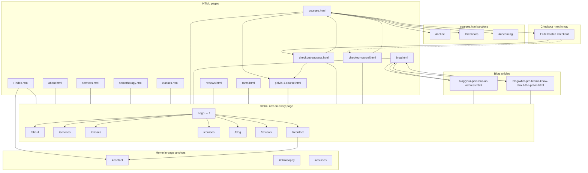

# LINK Pro site navigation map

All public pages use the **same global nav** (from `components/site-nav.html`): About, Services, Classes, Courses, Blog, Reviews, and Book Now → `/#contact`. Rams is linked from footers, not the main nav.

## Footer-only and external links

| From | To |
|------|-----|
| Most footers | `/blog`, `/rams`, `/#contact`, Instagram |
| Course cards (home / courses) | External linkprosport.com enroll URLs |
| SomaTherapy | `/somatherapy` (content links; not in global nav) |

## Maintaining this map

When routes or nav links change, update `components/site-nav.html` and run `npm run build:nav`. See `.cursor/rules/site-navigation.mdc`.
